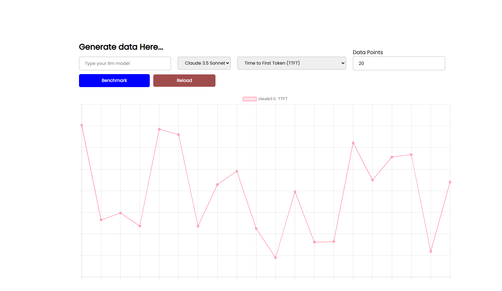
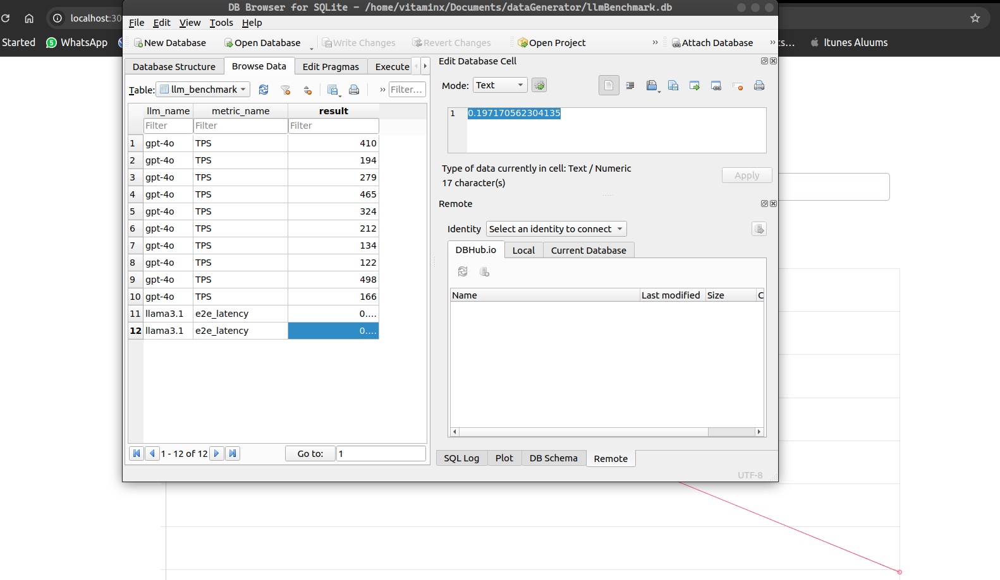

## Take-Home Assignment: LLM Benchmark Simulation and Infrastructure Deployment





### Installation 
- Clone this repository and change directory into the assignment folder 

- then type the following commands 

```bash
   $ pip install -r requirements.txt

```


### Start the web application 

```bash
    $ python app.py
```

### Go to the webpage 
- http://localhost:3001

### Generate data for different llm models 
<p> Select your option, and click on the benchmark button to generate data and save the data into an sqlite3 database </p>